# kotaoue

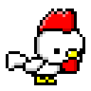

* 🐔 = chicken = にわとり
* 🐓 = rooster = おんどり
* ohyeah = kotaoue = おうえこうた

  
  
  
  
  
  
  
  
  
  

---

## 最近のPrivate

<!-- BLOG_ENTRIES_START -->
- [GitHubでv1.0.1みたいなリリースタグを切ったらv1にもコピーしてくれるActionsをMarketplaceに公開した件](https://qiita.com/kotaoue/items/e8de9bf75ae065e7e05a)
- [GitHub Marketplaceに公開したときに@v1とかメジャーVer指定したかった件](https://qiita.com/kotaoue/items/195ce5f817ad33a2d4a0)
- [github-readme-stats と github-profile-trophy を Self-hosting する際のトークン設定](https://qiita.com/kotaoue/items/dd7ab6b7230578632958)
- [0:00にGitHub Actionsが動かず3日ほどハマった件](https://qiita.com/kotaoue/items/89a51a4fbcdadb824c7a)
- [演じることと演じさせられること〜すなわち自由意志をキーワードにした繭期に対する一人の想い〜](https://note.com/kotaoue/n/n1fa85ce427cb)

<!-- BLOG_ENTRIES_END -->

| <!-- PEDOMETER_DATE_START -->3月10日の歩数<!-- PEDOMETER_DATE_END --> | [読みたい本](https://bookmeter.com/users/104/books/wish) | [今日の東京ソング](https://open.spotify.com/user/80642b45zkloa0ukardrhhqb6) |
| - | - | - |
| <!-- PEDOMETER_STEPS_START -->4,112歩<!-- PEDOMETER_STEPS_END --> | <!-- WISH_BOOK_START --><!-- WISH_BOOK_END --> | <!-- SPOTIFY_TRACK_START --><a href="https://open.spotify.com/track/2ttzli3A7SOXUvMv69xEKs"> Def Tech My Way</a><!-- SPOTIFY_TRACK_END --> |

---

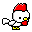
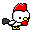
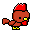
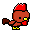
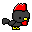
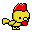
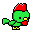
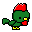
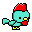
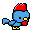
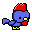
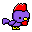
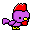
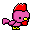
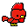
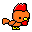
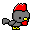
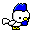
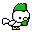
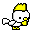

---

## 最近のGitHub

 

このリポジトリの直近1年のコミット可視化

---

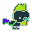
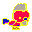
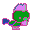
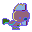
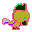
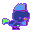
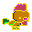
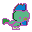
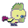
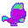
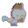
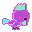
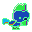
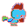
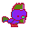
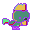
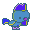
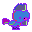
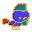
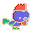

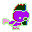

