# kotaoue

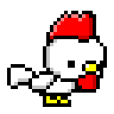

- 🐔 = chicken = にわとり
- 🐓 = rooster = おんどり
- ohyeah = kotaoue = おうえこうた

あなたは  人目の来訪者です！

  
  
  
  
  
  
  
  
  
  

---

## 最近のPrivate

<!-- BLOG_ENTRIES_START -->
- [Claude/Codex+GitHub Copilotで並列処理してた話](https://qiita.com/kotaoue/items/993e880bc8ae9b7d65ef)
- [Mac + GC551G2 で Switch2の画面を録画する](https://qiita.com/kotaoue/items/30dcb7bc4a4dc9bc9b00)
- [設計しない、形作る](https://zenn.dev/kotaoue/articles/e24f47411a81ae)
- [開発の成果物はシステムではなくて対話かもしれない](https://zenn.dev/kotaoue/articles/bb394256763f93)
- [バギーちゃんが好きだ](https://note.com/kotaoue/n/n412acfeeffb7)

<!-- BLOG_ENTRIES_END -->

| <!-- PEDOMETER_DATE_START -->9月2日の歩数<!-- PEDOMETER_DATE_END --> | バリカン | [読みたい本](https://bookmeter.com/users/104/books/wish) | [今日の東京ソング](https://open.spotify.com/user/80642b45zkloa0ukardrhhqb6) |
| - | - | - | - |
| <!-- PEDOMETER_STEPS_START -->4,234歩<!-- PEDOMETER_STEPS_END --> |  | <!-- WISH_BOOK_START --><!-- WISH_BOOK_END --> | <!-- SPOTIFY_TRACK_START --><a href="https://open.spotify.com/track/7Bblq2pqoOO0ZiUvXnnAgD"> Kohjiya, Shurkn Pap, MUD Love Me</a><!-- SPOTIFY_TRACK_END --> |

## 1年の歌

| 月 | タイトル | アーティスト |
| -- | -- | -- |
| 4月 | [春の歌](https://open.spotify.com/intl-ja/track/4F0m8AWIgR7SK6GyvPsPpc?si=44af16aa5c534dff) | スピッツ |
| 5月 | [ファイト！](https://open.spotify.com/intl-ja/track/2xblwpz5LEmOaS3jdKScpH?si=1f2cb9c84942473f) | 中島みゆき |
| 6月 | [ばらの花(Live ver.)](https://open.spotify.com/intl-ja/track/5GXL8LfagmtzIG9iNBwOMX?si=d8f75b3bb8db48e0) | くるり |
| 7月 | [ラッキープール](https://open.spotify.com/intl-ja/track/2rx06NRML56NhV98cB3Wy5?si=ec2988f500914136) | JUDY AND MARY |
| 8月 | [若者のすべて(2015 Live at 日比谷野音)](https://open.spotify.com/intl-ja/track/030RUmWx4CjkFCzrZMsZLy?si=f2ef199bdcd84d32) | フジファブリック |
| 9月 | [黄金の月 S](https://open.spotify.com/intl-ja/track/2z3PFbz3K1IzHSyHgJTZmf?si=54590082ef1b4956) | スガ シカオ |
| 10月 | [夜空ノムコウ S](https://open.spotify.com/intl-ja/track/6b9cGheFmYVhGgJvESHhIc?si=c19f726dd6224234) | スガ シカオ |
| 11月 | [枯葉](https://open.spotify.com/intl-ja/track/326j0QKIywNeP84HU6yheM?si=e0a39448aa6e4ebc) | 八代亜紀 |
| 12月 | [雪の華](https://open.spotify.com/intl-ja/track/6Zyizxfz4NXdCgVLwhuBNw?si=185d924b34e640f5) | 中島美嘉 |
| 1月 | [DEPARTURES (RADIO EDIT)](https://open.spotify.com/intl-ja/track/2ggw0Py9eptisSvB1xkgkc?si=660f141f0bf54550) | globe |
| 2月 | [winter fall](https://open.spotify.com/intl-ja/track/5BbvgKyzLhfDd1tWyIZOfT?si=3eb203638c944f57) | L'Arc〜en〜Ciel |
| 3月 | [Play A Love Song](https://open.spotify.com/intl-ja/track/4CBNW5OBfgfo1muPh3yeJc?si=efd7d1e398ed47df) | 宇多田ヒカル |

---

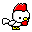
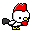
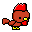
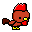
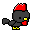
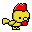
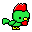
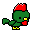
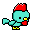
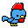
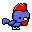
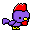
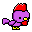
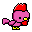
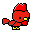
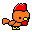
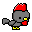
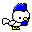

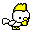
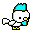

---

## 最近のGitHub

 

このリポジトリの直近1年のコミット可視化

## Links

- [aa: Any chance to convert this AA to PNG? ](https://aa.oue.me/)
- [t365: Turn text into contribution dates on a 7×53 grid.](https://t365.oue.me/)
- [doreataru: Spin the wheel and let fate decide.](https://doreataru.kotaoue.workers.dev/)
- [x_x: Giving your long posts a surgical x_x treatment.](https://x-x.oue.me/)
- [dotodoto: Draw Distinct Dots.](https://dotodoto.kotaoue.workers.dev/)
- [doreataru: Spin the wheel and let fate decide.](https://doreataru.kotaoue.workers.dev/)
- [ClipChron: Bookmarks and likes, clipped and chronicled.](https://clip-chron.vercel.app/)
- [kotaoue's Actions Dashboard](https://kotaoue.github.io/ActionsDashboard/)
- [kotaoue's Slack](https://app.slack.com/client/TRGK22K1B/CR550E2N7)

---

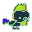
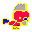
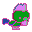
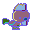
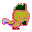
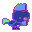
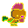
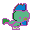
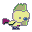
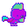

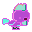

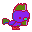
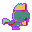
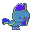
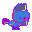

